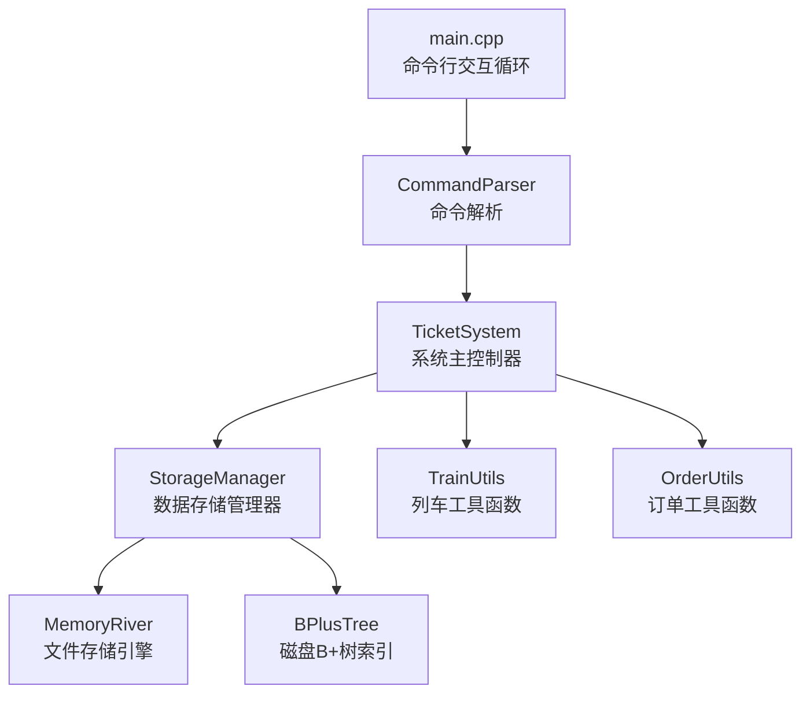

# 火车票管理系统

## 项目概述

本项目实现了一个火车票订票后端系统。系统以命令行交互方式运行，通过标准输入输出处理购票、查询、退票、用户管理等业务，并提供管理员后台功能。所有数据持久化在**本地文件系统**中，在严格的内存限制下通过自实现的 **B+树** 和 **MemoryRiver** 文件存储引擎进行高效读写。

### 核心特性

- **自实现的B+树**：基于磁盘块的 B+ 树索引，支持键值对的增删改查、范围查询
- **MemoryRiver 文件存储引擎**：固定长度记录的类文件系统，支持顺序写入、随机读写、记录计数，以文件偏移量为定位依据
- **多索引架构**：为关键查询路径建立 B+ 树辅助索引，包括用户索引、车次索引、订单索引、用户-订单索引、车站-车次索引、站对-车次索引、车次日期-订单索引
- **候补购票队列**：按时间戳优先级的候补队列，退票后自动触发候补处理
- **换乘查询**：支持恰好一次换乘的最优路径搜索（按时间或价格排序）

---

## 项目结构

```
Ticket-System-2026/
├── CMakeLists.txt                  # CMake 构建配置
├── README.md                       # 项目说明文档
├── management_system.md            # 管理系统详细需求文档
├── bonus.md                        # Bonus 任务说明
│
├── include/                        # 头文件
│   ├── bpt.hpp                     # B+ 树完整实现（FileManager + BPlusTree）
│   ├── MemoryRiver.hpp             # 固定长度记录文件存储引擎
│   ├── Command.hpp                 # 命令解析器（CommandParser）
│   ├── DateTime.hpp                # 日期/时间/日期时间类型定义
│   ├── Storage.hpp                 # 数据存储管理器（StorageManager）
│   ├── System.hpp                  # 系统主控制器（TicketSystem）
│   ├── TrainUtils.hpp              # 列车工具函数（站点查找、时间计算、座位查询）
│   └── OrderUtils.hpp              # 订单工具函数（排序、候补处理）
│
├── src/                            # 源文件
│   ├── main.cpp                    # 程序入口，命令行交互循环
│   ├── DateTime.cpp                # 日期时间实现
│   ├── Command.cpp                 # 命令解析实现
│   ├── Storage.cpp                 # 数据存储实现
│   ├── system.cpp                  # 系统主逻辑（所有指令处理）
│   ├── TrainUtils.cpp              # 列车工具函数实现
│   └── OrderUtils.cpp              # 订单工具函数实现
│
├── STLite/                         # 自实现 STL
    ├── vector/src/vector.hpp       # sjtu::vector<T>
    ├── map/src/map.hpp             # sjtu::map<K,V>（AVL 平衡树）
    ├── priority_queue/include/     # sjtu::priority_queue<T>
    └── deque/                      # sjtu::deque<T>

```

---

## 架构设计

### 整体架构



### 数据流

1. **输入**：标准输入接收带时间戳的命令行字符串
2. **解析**：`CommandParser` 将字符串解析为 `Command` 结构体（命令类型 + 键值对参数）
3. **路由**：`TicketSystem::execute()` 根据命令类型分发到对应的 `handle*` 方法
4. **持久化**：`StorageManager` 通过 `MemoryRiver` 读写固定长度二进制记录，通过 `BPlusTree` 维护多个辅助索引
5. **输出**：结果字符串写入标准输出，首行带时间戳

### 存储架构

| 数据实体 | 数据文件 | 主索引 | 辅助索引（B+ 树）|
|---------|---------|--------|------------------|
| 用户 | `users.db` | `user_index.idx`（按 username） | — |
| 车次 | `trains.db` | `train_index.idx`（按 trainID） | `train_station_index.idx`（按车站名）<br/>`train_station_pair_index.idx`（按出发-到达站对） |
| 订单 | `orders.db` | `order_index.idx`（按 orderID） | `order_user_index.idx`（按 username）<br/>`order_train_date_index.idx`（按 trainID+date） |

---

## 核心数据结构

### B+ 树 (`bpt.hpp`)

- **节点大小**：每节点 8192 字节（8KB），一个磁盘块
- **键长度**：最大 65 字节
- **模板参数**：`ValueType`（默认 `int`，存储文件偏移量）
- **支持操作**：
  - `insert(key, value)` — O(log N) 插入（自动分裂）
  - `remove(key, value)` — O(log N) 删除（自动合并/借位）
  - `find(key, &value)` — O(log N) 精确查找
  - `findAll(key, values[], max)` — O(log N + K) 返回所有匹配值的范围查询
- **空间回收**：`allocateBlock()` 优先从 `free_list` 空闲链表分配，删除节点时归还到链表

### MemoryRiver (`MemoryRiver.hpp`)

- **文件格式**：`[info_len 个 int 头部] [记录0] [记录1] ...`
- **记录大小**：`sizeof(T)` 字节，T 为固定大小结构体（POD 类型）
- **核心操作**：
  - `write(T &t)` → 返回写入位置偏移量 `index`
  - `update(T &t, int index)` → 原地更新
  - `read(T &t, int index)` → 随机读取
  - `get_info(int &tmp, int n)` / `write_info(int tmp, int n)` → 读写头部计数信息

### 二进制记录结构

所有持久化数据使用固定大小的 C 风格结构体，避免 `std::string` 导致的变长问题：

- **`BinaryUserRecord`**（约 124 字节）：`char username[21]`, `password[31]`, `name[32]`, `mail[31]`, `int privilege`, `bool deleted`
- **`BinaryTrainRecord`**（约 13KB）：含 `char stations[100][32]` 固定数组、`int prices[100]` 等
- **`BinaryOrderRecord`**（约 80 字节）：`int order_id`, `char username[21]`, `char train_id[21]`, 日期、起始站索引、数量、价格、状态、时间戳

---

## 指令实现细节

### 指令频率等级

| 等级 | 标记 | 最大调用次数 | 包含指令 |
|------|------|-------------|---------|
| 超级高频 | **[SF]** | ~1,000,000 | `query_ticket`, `query_profile`, `buy_ticket` |
| 高频 | **[F]** | ~100,000 | `login`, `logout`, `modify_profile`, `query_order`, `refund_ticket` |
| 普通 | **[N]** | ~10,000 | `add_user`, `add_train`, `delete_train`, `release_train`, `query_train`, `query_transfer` |
| 罕见 | **[R]** | ~100 | `clean`, `exit` |

### 关键算法

add_user      [N]  → user_index.insert
login         [F]  → user_index.find
logout        [F]  → user_index.find
query_profile [SF] → user_index.find
modify_profile[F]  → user_index.find
add_train     [N]  → train_index.insert + train_station_index.insert×S + train_station_pair_index.insert×(S²/2)
delete_train  [N]  → train_index.find + remove + station/pair index remove×多
release_train [N]  → train_index.find
query_train   [N]  → train_index.find + order_train_date_index.findAll
query_ticket  [SF] → train_station_pair_index.findAll → train_index.find×K → order_train_date_index.findAll×K
query_transfer[N]  → train_station_index.findAll → train_station_pair_index.findAll×S → train_index.find×多 → order_train_date_index.findAll×多
buy_ticket    [SF] → user_index.find + train_index.find + order_train_date_index.findAll + order_index.insert + order_user_index.insert + order_train_date_index.insert
query_order   [F]  → order_user_index.findAll → train_index.find×K
refund_ticket [F]  → order_user_index.findAll → order_index.find + order_train_date_index.findAll×多(候补)
clean         [R]  → 删除所有文件，重建
exit          [R]  → 无 B+ 树操作

#### `query_ticket` [SF] — 直达车票查询

1. 通过 `train_station_pair_index` 站对索引，B+ 树 `findAll` 获取所有同时经过出发站和到达站（且出发站在前）的车次
2. 对每个候选车次：
   - 检查 `released` 状态
   - 计算出发/到达时间、累计票价
   - 通过 `train_date_index` 加载该车次该日期的所有成功订单，计算各段座位占用 → 得出区间最小可用座位数
3. 按指定排序键（`time` 或 `cost`）对结果排序并输出

#### `query_transfer` [N] — 换乘查询

1. 通过单站索引加载所有经过出发站的车次（第一程候选）
2. 对每个第一程车次，遍历其后续各站作为换乘站
3. 在换乘站通过站对索引查找第二程车次（换乘站 → 目的地）
4. 对每个有效的换乘组合，计算总时间、总票价，判断是否为当前最优
5. 时间复杂度：O(T₁ × S × T₂)，其中 T₁ 为经过出发站的车次数，S 为停站数，T₂ 为换乘站到目的地的车次数

#### `buy_ticket` [SF] — 购票 / 候补

1. 验证用户登录状态、车次发布状态
2. 计算区间可用座位数（`availableSeats`）
3. 若余票 ≥ 购买数量 → 创建成功订单，返回总价
4. 若余票不足且 `-q true` → 创建候补订单，状态设为 `Pending`，返回 `queue`
5. 否则返回购票失败

#### `refund_ticket` [F] — 退票 + 候补处理

1. 按 `query_order` 的逆序（从新到旧）定位第 n 个订单
2. 若该订单状态为 `Success`，将其标记为 `Refunded`
3. 触发 `processWaitlist`：加载该车次该日期的所有待处理候补订单（按时间戳升序），依次检查是否有足够余票满足，满足则转为 `Success`

---